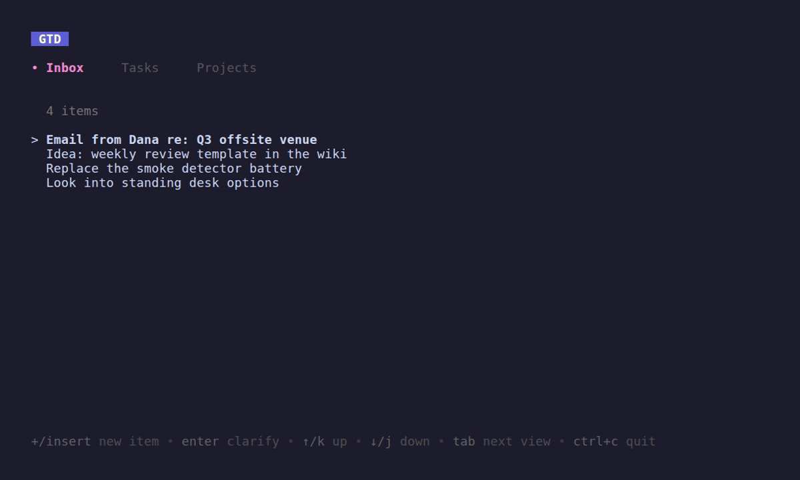
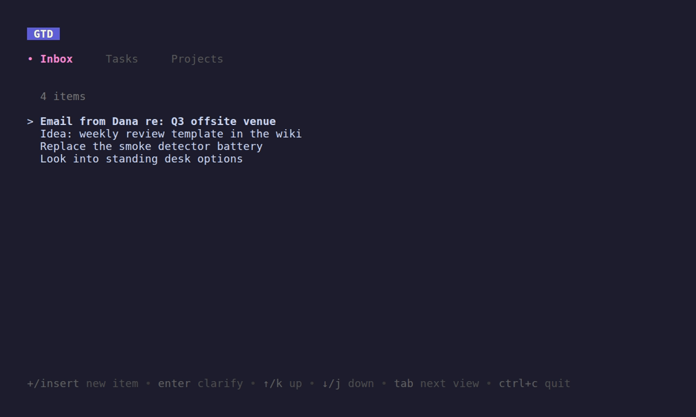

# gtd-tui

A personal, single-user productivity app for terminal users, built around the
[Getting Things Done](https://gettingthingsdone.com/) methodology. Tasks,
projects, and notes live in one cross-linked, navigable interface — no app
switching, no maintenance overhead, no friction between thinking and capturing.

> Status: **early development.** The Inbox, Tasks, and Projects vertical slice
> is usable — capture, clarify, and the do-it-now flow all work. References,
> Meetings, Comments, and Timelines are specified but not yet implemented. See
> [Roadmap](#roadmap).

## Why

Most GTD tools fail the same way: the system needs more upkeep than the work it's
tracking. `gtd-tui` is built around the opposite premise — capture should take
seconds, navigation should be one keystroke, and every entity should carry its
own history so you can answer "what happened here, and why?" without hunting
through separate logs.

The product principles live in
[`openspec/specs/product-vision/spec.md`](openspec/specs/product-vision/spec.md):

- **Low ceremony** — capture is a single low-friction interaction.
- **One pane of glass** — tasks, projects, and notes are views of the same data.
- **Easy linking** — relationships are first-class; cross-links are easy to
  create and follow.
- **Timeline as context** — every entity has a chronological history.

Out of scope: team collaboration, time tracking, calendar replacement.

## Demo

Capture an item, then clarify it into a next action:


Browse, complete, and filter tasks:



Open a project to see its outcome and linked tasks:



The GIFs are recorded with [vhs](https://github.com/charmbracelet/vhs) from the
tapes in [`demo/`](demo/), driven against a seeded throwaway database. See
[Development](#development) to regenerate them.

## Install

Requires Go 1.26 or newer. No CGO, no native dependencies.

```sh
go install github.com/qualidafial/gtd-tui/cmd/gtd@latest
```

Or build from source:

```sh
git clone https://github.com/qualidafial/gtd-tui
cd gtd-tui
go build -o gtd ./cmd/gtd
```

## Run

```sh
gtd
```

The database is created on first run at `$XDG_CONFIG_HOME/gtd/gtd.db` (typically
`~/.config/gtd/gtd.db`). Migrations are applied automatically. Set `GTD_DB` to
point at a different database file (used by the demo recordings to stay isolated
from your real data).

## Keybindings

Global:

| Key       | Action          |
| --------- | --------------- |
| `?`       | Toggle help     |
| `tab`     | Next tab        |
| `shift+tab` | Previous tab  |
| `esc`     | Back / cancel   |
| `ctrl+c`  | Quit            |

Inbox:

| Key            | Action                       |
| -------------- | ---------------------------- |
| `+` / `insert` | Capture new item             |
| `enter`        | Clarify selected item        |

Items are write-once on capture; refinement happens inside the clarify wizard,
which walks Discard / Incubate / ClarifyAsTask / ClarifyAsProject (including the
do-it-now shortcut).

Task list:

| Key        | Action            |
| ---------- | ----------------- |
| `+` / `insert` | New task      |
| `enter`    | Open task view    |
| `e`        | Edit task         |
| `space`    | Toggle complete   |
| `delete`   | Drop task         |
| `p`        | Jump to project   |
| `c`        | Convert to project (standalone tasks only) |
| `shift+↑/↓`| Reorder (within current filter) |
| `shift+home/end` | Move first / last (within current filter) |
| `/`        | Filter            |
| `\`        | Reset filter      |

Project list:

| Key        | Action            |
| ---------- | ----------------- |
| `+` / `insert` | New project   |
| `e`        | Edit project      |
| `enter`    | Open project view |
| `c`        | Convert to task (empty open projects only) |
| `space`    | Toggle complete   |
| `delete`   | Drop project      |
| `s`        | Park (set someday)|
| `shift+↑/↓`| Reorder (within current filter) |
| `shift+home/end` | Move first / last (within current filter) |
| `/`        | Filter            |
| `\`        | Reset filter      |

Project view:

| Key     | Action                                      |
| ------- | ------------------------------------------- |
| `e`     | Edit project                                |
| `l`     | Link an existing standalone task into the project |
| `c`     | Convert to task (empty open projects only)  |

Task view:

| Key      | Action                                      |
| -------- | ------------------------------------------- |
| `e`      | Edit task                                   |
| `space`  | Toggle complete                             |
| `delete` | Drop task                                   |
| `p`      | Assign to project                           |
| `c`      | Convert to project (standalone tasks only)  |
| `g`      | Go to linked project (tasks in a project)   |

Linking a task into a `someday` project removes it from the default task views
until the project is reopened — the task's status is unchanged.

## Filter syntax

The `/` query bar accepts a small DSL for narrowing the visible list. Tokens
are whitespace-separated. A `key:value` token with a recognized key sets a
structured filter; any other token is a free-text term. Multiple structured
clauses combine with AND, and the last value for a repeated key wins. Free-text
terms are also ANDed — each must match the title, description, or assignee.

Task list keys: `status`, `assignee`, `due`, `defer`, `ready`.

- `status:open` — open items (default); also `done`, `dropped`
- `assignee:bob` — delegated to a given person
- `due:today` — date-predicate; see forms below
- `defer:1w` — hidden until a defer date
- `ready:now` — available as of the current instant

Project list keys: `status` (`open`, `someday`, `done`, `dropped`) plus
free-text. There is no `kind` key; `kind:delegated` is treated as free text.

Date-predicate values (`due`, `defer`, `ready`) accept:

- `now` — the current instant (not rounded to a day)
- relative: `-Nd` / `Nd` / `Nw` (`d`=days, `w`=weeks; leading `-` = past)
- keyword: `overdue` (≡ `-1d`), `today` (≡ `0d`), `week` (≡ `7d`)
- ISO date: `2026-06-01`
- `none` / `any` — the unset / set variants (`due` and `defer` only)

Examples: `status:open assignee:bob`, `due:overdue`, `ready:today tomato`.

Invalid clauses are highlighted in the bar and don't apply until corrected.

## Concepts

The domain model is captured in
[`openspec/specs/domain-model/spec.md`](openspec/specs/domain-model/spec.md).
Briefly:

- **Item** — an unprocessed inbox capture. Clarified into a Task, Project, or
  Reference (lineage preserved via soft-delete).
- **Task** — a single actionable item. `Kind` is `next_action` or `delegated`;
  `Status` is `open`, `done`, or `dropped`. Belongs to zero or one Project.
- **Project** — a multi-step outcome. `Status` is `open`, `someday` (parked),
  `done`, or `dropped`. Terminal transitions cascade or detach open tasks; the
  invariant "no open tasks under a closed project" is enforced.
- **Reference** — standalone markdown content kept for retrieval.
- **Meeting** — title, time slot, attendees, markdown body. Action items
  captured during a meeting flow to the inbox with a link back.
- **Comment** — short, event-shaped text attached to a Task or Project; recorded
  implicitly on edits and explicitly via the comment API.

The clarify workflow (Capture → Clarify → Organize → Engage → Reflect) and the
five clarify outcomes (Discard, Incubate, FileAsReference, ClarifyAsTask,
ClarifyAsProject) are in
[`openspec/specs/gtd-workflows/spec.md`](openspec/specs/gtd-workflows/spec.md),
which also includes a Mermaid diagram of the decision flow.

## Project layout

Follows [Ben Johnson's Go application
structure](https://medium.com/@benbjohnson/structuring-applications-in-go-3b04be4ff091):

```
.                       Root package — domain types and service interfaces only
├── cmd/gtd/            CLI entry point
├── cmd/gtd-seed/       Demo-database seeder (used by demo/generate.sh)
├── demo/               VHS tapes and generated GIFs
├── service/            Cross-store orchestration (transactional)
├── sqlite/             SQLite implementation
│   └── migrations/     Embedded SQL migrations, applied in order
├── tui/                Bubbletea v2 UI
│   └── pages/          One package per top-level page (tasks, projects, …)
├── internal/set/       Internal generic Set type
└── openspec/           Specifications and proposed changes
    ├── specs/          Authoritative current behavior
    └── changes/        Proposed and archived changes
```

Architectural rules — value semantics, modernc.org/sqlite driver, squirrel for
queries, CHECK constraints, WAL + foreign keys, service-level transactions —
are in [`openspec/specs/architecture/spec.md`](openspec/specs/architecture/spec.md).

## Development

```sh
go test ./...        # full suite, uses in-memory SQLite
go build ./...
openspec validate --specs  # validate all specs
./demo/generate.sh   # re-record the README GIFs (needs vhs, ttyd, ffmpeg)
```

The demo GIFs are produced by [vhs](https://github.com/charmbracelet/vhs) from
the tapes in `demo/`. `generate.sh` builds `gtd`, seeds a throwaway database via
`cmd/gtd-seed`, and records each tape against it; install `vhs`, `ttyd`, and
`ffmpeg` first.

Specs are the source of truth. Behavioral changes start with a proposal under
`openspec/changes/`; see existing changes for the format. The `opsx:propose` /
`opsx:apply` / `opsx:archive` slash commands automate the workflow.

## Roadmap

Implemented:

- Inbox (Item capture, clarify wizard — Discard / Incubate / ClarifyAsTask /
  ClarifyAsProject, including the do-it-now flow)
- Tasks (CRUD, status transitions, ordering, filtering)
- Projects (CRUD, status transitions including someday/park, ordering, filtering,
  project view with linked tasks, project picker overlay)
- Task/project restructuring (convert a standalone task into a project, collapse
  an empty open project back into a task, link an existing task into a project)
- Shared query bar with live-preview validation
- TUI view stack with overlay support

Specified, not yet implemented (see [`openspec/changes/`](openspec/changes/)):

- **References** — Reference entity + FileAsReference
- **Meetings** — Meeting + MeetingLink + AddActionItem
- **Comments** — edit-with-comment + standalone comments
- **Timelines** — activity history per entity + global Reflect view

## License

[MIT](LICENSE) © 2026 Matthew Hall
