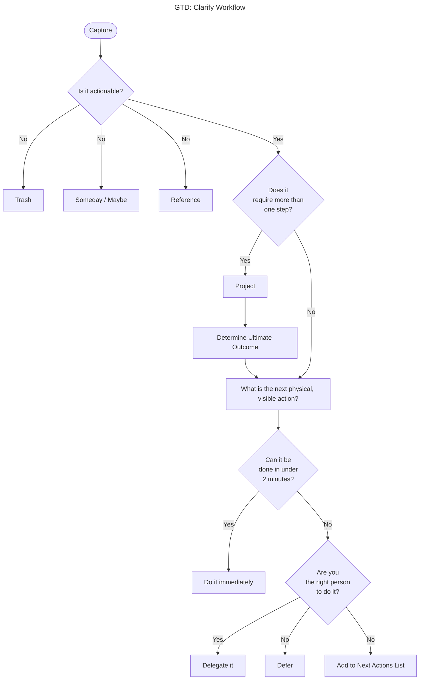

# gtd-workflows Specification

## Purpose
Defines the user-facing GTD workflows the app implements — Capture, Clarify, Organize, Engage, Capture Context, and Reflect — as behavioral requirements independent of UI layout. This is the authoritative description of *how the system behaves* for each stage of the GTD loop, including the five clarify outcomes that drain the inbox.

## Requirements
### Requirement: Capture workflow for inbox
The system SHALL provide a Capture workflow for quickly adding items to the inbox without friction. The inbox SHALL be the default entry point when it contains unprocessed items.

#### Scenario: Quick capture to inbox
- **WHEN** user captures a thought
- **THEN** system creates an inbox Item with minimal friction

#### Scenario: Inbox as default entry point
- **WHEN** user opens the app and inbox has unprocessed items
- **THEN** system shows the inbox view

### Requirement: Clarify workflow for processing inbox
The system SHALL provide a Clarify workflow for reviewing inbox items one at a time. Each clarify operation SHALL be a single transaction that creates (or doesn't) a destination entity and stamps the Item's ClarifiedInto pointer.

#### Scenario: Review inbox item
- **WHEN** user processes an inbox item
- **THEN** system shows the item with a detail panel
- **AND** system presents clarify options

### Requirement: Discard clarify outcome
The Discard outcome SHALL mark an Item as discarded for non-actionable, unwanted captures. The Item SHALL be marked, not hard-deleted.

#### Scenario: Discard inbox item
- **WHEN** user discards an inbox item
- **THEN** Item is marked discarded
- **AND** no destination entity is created

### Requirement: Incubate clarify outcome
The Incubate outcome SHALL create a Project in `someday` status for non-actionable items to revisit later. The Item SHALL point to the new Project. There is no separate Someday entity.

#### Scenario: Incubate inbox item
- **WHEN** user incubates an inbox item
- **THEN** system creates a Project with status someday
- **AND** Item.ClarifiedIntoProjectID points to the Project

### Requirement: FileAsReference clarify outcome
The FileAsReference outcome SHALL spawn a Reference entity for non-actionable content to keep for retrieval. The Item SHALL point to the new Reference.

#### Scenario: File inbox item as reference
- **WHEN** user files an inbox item as reference
- **THEN** system creates a Reference entity
- **AND** Item.ClarifiedInto points to the Reference

### Requirement: ClarifyAsTask clarify outcome
The ClarifyAsTask outcome SHALL spawn a Task entity for actionable single-step items. The task kind is chosen at clarify time, optionally with a project. The Item SHALL point to the new Task. For "do-it-now" cases, the Task is created with Status: done immediately, preserving the timeline entry.

#### Scenario: Clarify as next action
- **WHEN** user clarifies an inbox item as a next action task
- **THEN** system creates a Task with kind next_action
- **AND** Item.ClarifiedInto points to the Task

#### Scenario: Clarify as delegated task
- **WHEN** user clarifies an inbox item as delegated
- **THEN** system creates a Task with kind delegated and an Assignee
- **AND** Item.ClarifiedInto points to the Task

#### Scenario: Clarify and assign to project
- **WHEN** user clarifies an inbox item as a task and selects a project
- **THEN** Task.ProjectID references the project

#### Scenario: Do it now
- **WHEN** user clarifies an inbox item as done immediately
- **THEN** system creates a Task with Status: done
- **AND** timeline shows the captured-to-done transition

### Requirement: ClarifyAsProject clarify outcome
The ClarifyAsProject outcome SHALL spawn a Project entity for actionable multi-step outcomes. The Item SHALL point to the new Project. The UI then prompts for the first next-action task in the new project.

#### Scenario: Clarify as project
- **WHEN** user clarifies an inbox item as a project
- **THEN** system creates a Project
- **AND** Item.ClarifiedInto points to the Project
- **AND** UI prompts for the first next action

#### Scenario: Do first step of new project
- **WHEN** user clarifies as project and completes first step immediately
- **THEN** system creates the Project
- **AND** system creates a done Task within it
- **AND** UI prompts for the actual next action

### Requirement: Organize workflow for task management
The system SHALL provide an Organize workflow for viewing tasks filtered by status, project, or due date. When the inbox is empty, the system SHALL navigate to the task list (next actions). Projects SHALL show their linked tasks and notes.

#### Scenario: View filtered tasks
- **WHEN** user views tasks
- **THEN** system displays tasks filterable by status, project, or due date

#### Scenario: Empty inbox shows task list
- **WHEN** inbox is empty
- **THEN** system shows the task list as default view

#### Scenario: Project shows linked tasks
- **WHEN** user views a project
- **THEN** system displays the project's linked tasks

### Requirement: Engage workflow for working on tasks
The system SHALL provide an Engage workflow for seeing what to work on next from the task list. Users SHALL be able to navigate from a task to its linked notes and project context. Users SHALL be able to view timeline of activity on any task or project.

#### Scenario: See next actions
- **WHEN** user views the task list
- **THEN** system shows actionable next tasks

#### Scenario: Navigate to project context
- **WHEN** user selects a task
- **THEN** user can navigate to the task's project

#### Scenario: View task timeline
- **WHEN** user views a task's timeline
- **THEN** system shows activity history for that task

### Requirement: Capture Context workflow for recording context
The system SHALL provide a Capture Context workflow for recording context on tasks and projects. Users SHALL be able to edit with an optional one-line comment recorded as a timeline event. Users SHALL be able to add standalone comments without entering edit mode. Meeting records capture title, time slot, attendees, and discussion notes; action items flow to inbox automatically with a link back to the meeting.

#### Scenario: Edit with comment
- **WHEN** user edits a task with a comment
- **THEN** system records the comment as a timeline event

#### Scenario: Standalone comment
- **WHEN** user adds a comment without editing
- **THEN** system records the comment for contextual updates

#### Scenario: Add meeting action item
- **WHEN** user captures an action item during a meeting
- **THEN** system creates an inbox Item linked to the Meeting
- **AND** Meeting body is updated with the action item line

### Requirement: Reflect workflow for reviewing activity
The system SHALL provide a Reflect workflow for reviewing activity timelines. Timelines SHALL be scoped to a project, task, or note. A global timeline across all entities SHALL be available. Because capturing is low-friction, timelines become an accurate record of what actually happened and when.

#### Scenario: Project timeline
- **WHEN** user views a project's timeline
- **THEN** system shows all activity on that project in chronological order

#### Scenario: Global timeline
- **WHEN** user views the global timeline
- **THEN** system shows activity across all entities

